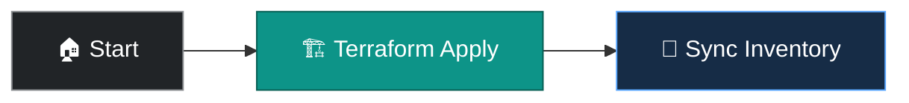

# Terraform — Provision RHEL VM (Community)

Smoke-test Terraform provisioning with the open-source Terraform CLI on the AAP execution environment. Uses shared HCL in `cloud/terraform/aws_rhel_vm/` to create a tagged RHEL EC2 instance in the default VPC, then syncs AWS inventory.

Engineering and CI validation path — customer demos should use the Enterprise workflow with Terraform Enterprise or HCP Terraform.

## Prerequisites

- **AWS** credential configured with Access Key and Secret Key
- **APD Machine Credential** with an SSH private key (or paste `tf_public_key` in the survey)
- Run **APD ǀ Single demo setup** with `cloud`

## Configure credentials

Update the **AWS** credential before first run. Ensure **APD Machine Credential** includes the SSH private key that matches the public key deployed to the EC2 key pair.

## Survey prompts

| Prompt | Variable | Type | Default | Description |
|--------|----------|------|---------|-------------|
| AWS Region | `tf_aws_region` | multiplechoice | `us-east-2` | Region for EC2 resources |
| EC2 Name tag prefix | `tf_name_tag` | text | `tf_rhel9` | Base `Name` tag (`-1`, `-2` when count > 1) |
| Instance count | `tf_instance_count` | multiplechoice | `1` | Number of instances (max 2) |
| Instance type | `tf_instance_type` | text | `t3.micro` | EC2 instance type |
| Owner tag | `tf_owner` | text | `apd-demo` | EC2 `owner` tag |
| Blueprint tag | `tf_blueprint` | text | `rhel9` | EC2 `blueprint` tag for inventory groups |
| SSH public key | `tf_public_key` | textarea | (empty) | Optional; derived from Machine Credential if blank |

## Workflow

1. Stages HCL from this repository and runs `terraform apply` on the runner
2. Instances are tagged `managed-by=aap-product-demos` and `apd=true` for dynamic inventory
3. Syncs **AWS Inventory** so hosts appear under `cloud_aws` and `blueprint_*` groups

## Job templates

| Template | Playbook | Description |
|----------|----------|-------------|
| Terraform — Provision RHEL VM (Community) | [`cloud/setup.yml`](../setup.yml) | Workflow: Community provision + inventory sync |
| Cloud ǀ Terraform ǀ AWS ǀ Provision VM (Community) | [`cloud/terraform/provision_community.yml`](../terraform/provision_community.yml) | Standalone Terraform CLI apply |

## Why it matters

Demonstrates day-zero AWS provisioning with Terraform HCL while keeping APD inventory tags consistent with Ansible-native cloud demos — without requiring Terraform Enterprise.
